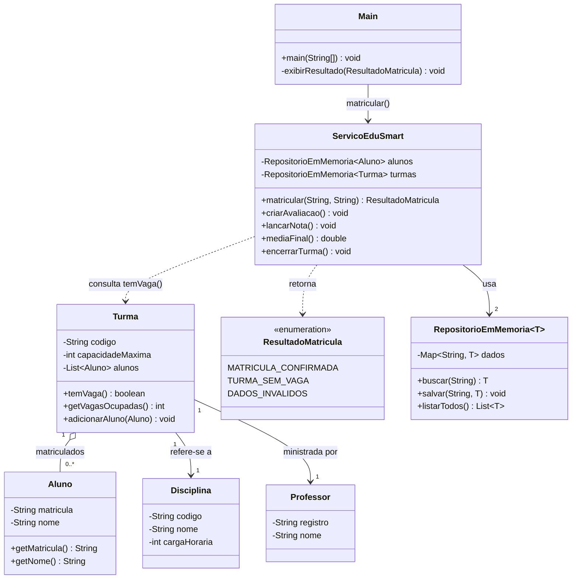

[diagrama-classes-RF-08-01.md](https://github.com/user-attachments/files/32267542/diagrama-classes-RF-08-01.md)
## Diagrama de classes — RF-08-01

Elementos introduzidos por esta fatia: `capacidadeMaxima`, `temVaga()`,
`getVagasOcupadas()` e o enum `ResultadoMatricula`.
