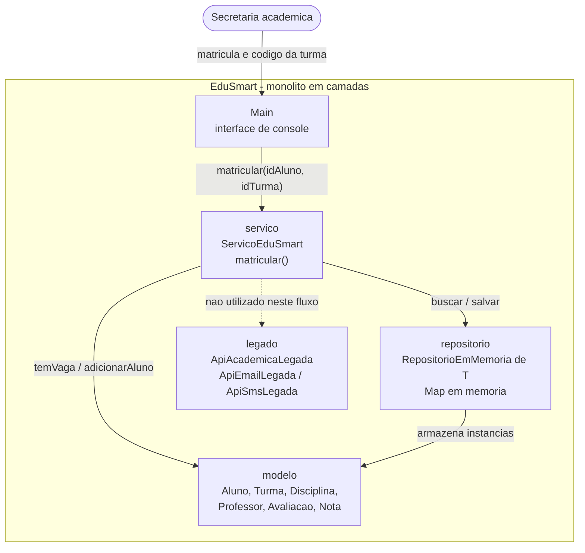

[diagrama-componentes-RF-08-01.md](https://github.com/user-attachments/files/32267649/diagrama-componentes-RF-08-01.md)
## Diagrama de componentes — RF-08-01

A camada `legado` aparece tracejada porque existe no projeto, mas não é acionada pela
matrícula — o acoplamento concreto com `new` afeta `lancarNota()` e `encerrarTurma()`.
