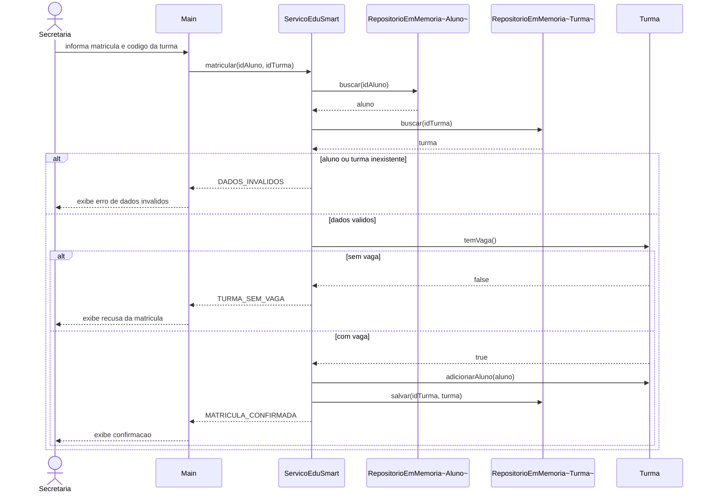

[diagrama-sequencia-RF-08-01.md](https://github.com/user-attachments/files/32267569/diagrama-sequencia-RF-08-01.md)
## Diagrama de sequência — RF-08-01

```mermaid
sequenceDiagram
    actor Secretaria
    participant Main
    participant Servico as ServicoEduSmart
    participant RepAluno as RepositorioEmMemoria~Aluno~
    participant RepTurma as RepositorioEmMemoria~Turma~
    participant Turma

    Secretaria->>Main: informa matricula e codigo da turma
    Main->>Servico: matricular(idAluno, idTurma)
    Servico->>RepAluno: buscar(idAluno)
    RepAluno-->>Servico: aluno
    Servico->>RepTurma: buscar(idTurma)
    RepTurma-->>Servico: turma

    alt aluno ou turma inexistente
        Servico-->>Main: DADOS_INVALIDOS
        Main-->>Secretaria: exibe erro de dados invalidos
    else dados validos
        Servico->>Turma: temVaga()
        alt sem vaga
            Turma-->>Servico: false
            Servico-->>Main: TURMA_SEM_VAGA
            Main-->>Secretaria: exibe recusa da matricula
        else com vaga
            Turma-->>Servico: true
            Servico->>Turma: adicionarAluno(aluno)
            Servico->>RepTurma: salvar(idTurma, turma)
            Servico-->>Main: MATRICULA_CONFIRMADA
            Main-->>Secretaria: exibe confirmacao
        end
    end
```
