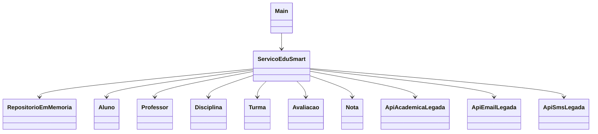

# Diagrama de turmas - estado inicial

```mermaid
classDiagram
    class Main
    class ServicoEduSmart
    class RepositorioEmMemoria
    class Aluno
    class Professor
    class Disciplina
    class Turma
    class Avaliacao
    class Nota
    class ApiAcademicaLegada
    class ApiEmailLegada
    class ApiSmsLegada

    Main --> ServicoEduSmart
    ServicoEduSmart --> RepositorioEmMemoria
    ServicoEduSmart --> Aluno
    ServicoEduSmart --> Professor
    ServicoEduSmart --> Disciplina
    ServicoEduSmart --> Turma
    ServicoEduSmart --> Avaliacao
    ServicoEduSmart --> Nota
    ServicoEduSmart --> ApiAcademicaLegada
    ServicoEduSmart --> ApiEmailLegada
    ServicoEduSmart --> ApiSmsLegada
```

Atualize este diagrama quando o código for reorganizado.
