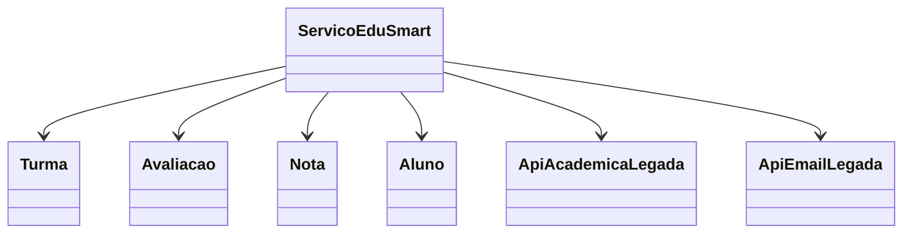

# Diagrama de turmas - referência do legado inicial

```mermaid
classDiagram
    class ServicoEduSmart
    class Turma
    class Avaliacao
    class Nota
    class Aluno
    class ApiAcademicaLegada
    class ApiEmailLegada

    ServicoEduSmart --> Turma
    ServicoEduSmart --> Avaliacao
    ServicoEduSmart --> Nota
    ServicoEduSmart --> Aluno
    ServicoEduSmart --> ApiAcademicaLegada
    ServicoEduSmart --> ApiEmailLegada
```

Este arquivo representa uma visão simplificada do legado entregue no início do semestre.
