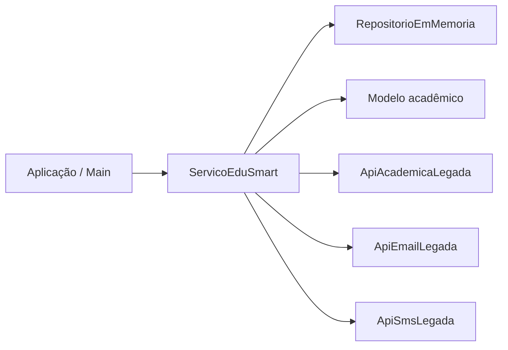

# Diagrama de componentes - estado inicial

```mermaid
flowchart LR
    Main[Aplicação / Main] --> Service[ServicoEduSmart]
    Service --> Repo[RepositorioEmMemoria]
    Service --> Model[Modelo acadêmico]
    Service --> Academic[ApiAcademicaLegada]
    Service --> Email[ApiEmailLegada]
    Service --> Sms[ApiSmsLegada]
```

O desenho evidencia a concentração de dependências no serviço central. Ele deve evoluir junto com o código e com as decisões arquiteturais registradas.
