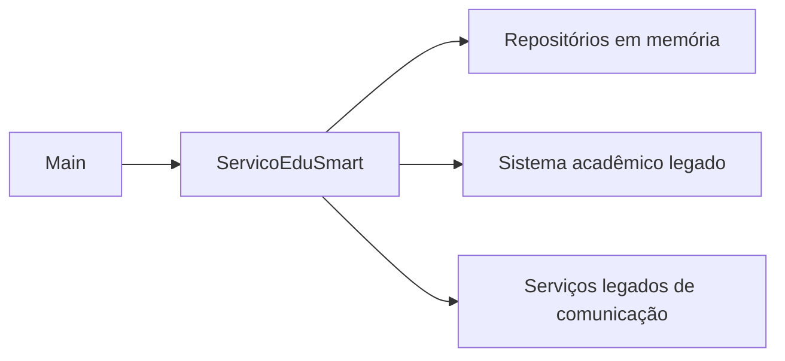

# Componentes - referência inicial

```mermaid
flowchart LR
    App[Main] --> Service[ServicoEduSmart]
    Service --> Data[Repositórios em memória]
    Service --> Academic[Sistema acadêmico legado]
    Service --> Notify[Serviços legados de comunicação]
```
