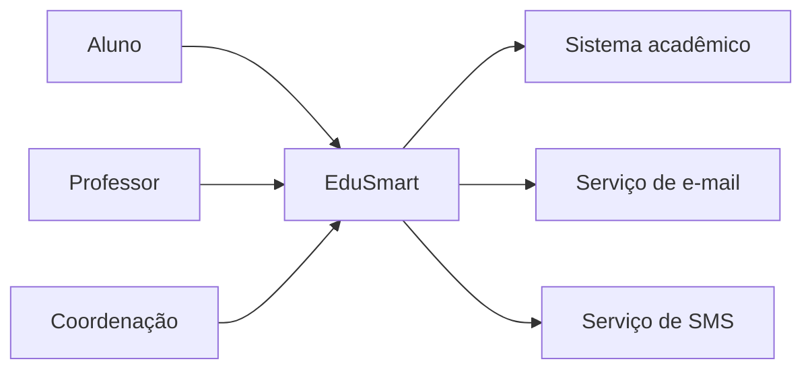

# Diagrama de contexto atual

```mermaid
flowchart LR
    Aluno[Aluno] --> EduSmart[EduSmart]
    Professor[Professor] --> EduSmart
    Coordenacao[Coordenação] --> EduSmart
    EduSmart --> Academico[Sistema acadêmico]
    EduSmart --> Email[Serviço de e-mail]
    EduSmart --> SMS[Serviço de SMS]
```

O diagrama deve acompanhar `../../contexto/contexto-atual.md`.
