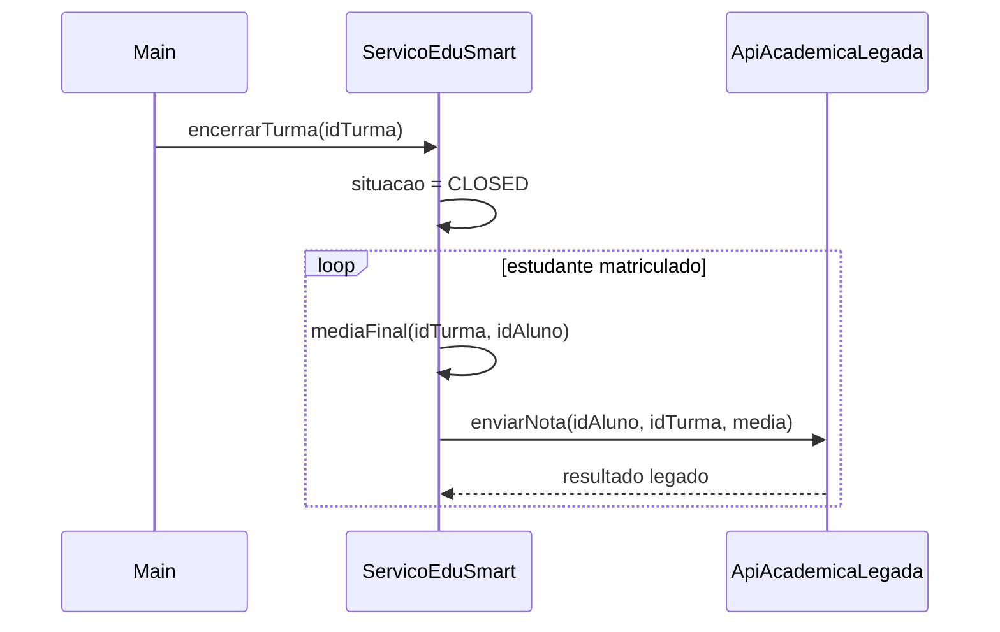

# Sequência - fechamento de turma no estado inicial

```mermaid
sequenceDiagram
    participant Main
    participant Service as ServicoEduSmart
    participant Academic as ApiAcademicaLegada

    Main->>Service: encerrarTurma(idTurma)
    Service->>Service: situacao = CLOSED
    loop estudante matriculado
        Service->>Service: mediaFinal(idTurma, idAluno)
        Service->>Academic: enviarNota(idAluno, idTurma, media)
        Academic-->>Service: resultado legado
    end
```

A sequência registra o comportamento atual e deve ser revisada quando a comunicação ou as responsabilidades forem alteradas.
